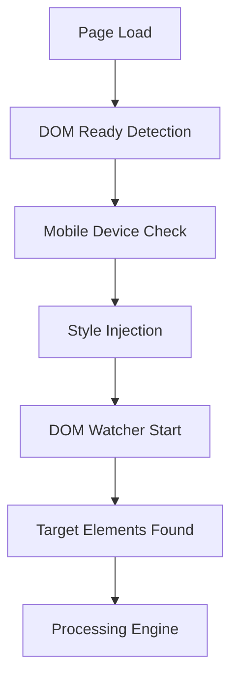
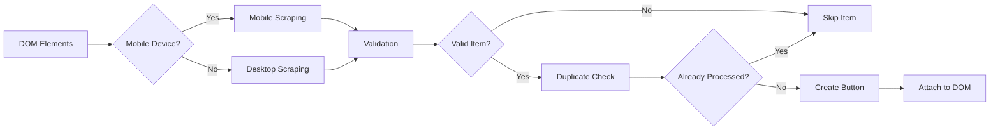

# LibMaps Technical Architecture

## 🏗️ System Overview

LibMaps is a client-side JavaScript integration that enhances SirsiDynix Enterprise catalog systems with interactive mapping capabilities. The system operates entirely in the browser, processing DOM elements to extract item information and generate mapping interfaces.

## 📐 Architecture Diagram

```
┌─────────────────┐    ┌──────────────────┐    ┌─────────────────┐
│   Web Browser   │    │   LibCal API     │    │   Library Map   │
│                 │    │                  │    │    Service      │
├─────────────────┤    ├──────────────────┤    ├─────────────────┤
│  SirsiDynix     │    │  • Map Generation│    │ • Floor Plans   │
│  Enterprise     │◄──►│  • Location      │◄──►│ • Item Locations│
│                 │    │    Mapping       │    │ • Navigation    │
├─────────────────┤    │  • Print Maps    │    │   Instructions  │
│  LibMaps.js     │    └──────────────────┘    └─────────────────┘
│  • DOM Scraping │
│  • Button Gen   │
│  • Mobile Logic │
└─────────────────┘
```

## 🔧 Core Components

### 1. DOM Processing Engine

**Purpose**: Extract item information from catalog pages
**Key Functions**:
- `scrapeDetailRows()` - Desktop DOM processing
- `scrapeMobileCallNumbers()` - Mobile-optimized processing
- `extractText()` - Content sanitization
- `extractCollectionText()` - Collection name parsing

**Mobile-First Architecture**:
```javascript
// Mobile detection triggers specialized processing
if (isMobileDevice) {
    items = this.scrapeMobileCallNumbers(items);
    // Skip desktop row processing to prevent duplicates
    return items;
}
```

### 2. Duplicate Prevention System

**Purpose**: Ensure single button per item across all processing methods
**Implementation**:
```javascript
springyILS.processedItems = new Set(); // Global tracking
springyILS.createItemKey(call, location, collection); // Unique identification
springyILS.markAsProcessed(call, location, collection); // State management
```

**Multi-Level Prevention**:
1. **Global Set**: Tracks all processed items across sessions
2. **DOM Markers**: CSS classes prevent reprocessing
3. **Batch Deduplication**: Removes duplicates within processing batches

### 3. Security Layer

**XSS Prevention**:
```javascript
cleanText: function(text) {
    return text.trim()
        .replace(/<script[^>]*>.*?<\/script>/gi, "") // Remove scripts
        .replace(/<[^>]*>/g, "")                     // Strip HTML
        .replace(/\s+/g, " ");                       // Normalize whitespace
}
```

**Input Validation**:
- All DOM-extracted content sanitized
- Collection/location names validated against allowlists
- Safe HTML generation for UI components

### 4. Mobile Optimization Layer

**DOM Structure Handling**:
```javascript
// Mobile DOM differs from desktop - collection elements may be separate
if (!collectionElement) {
    // Search document-wide for collection data
    var docCollectionElements = document.querySelectorAll('.detailItemsTable_SD_HZN_COLLECTION');
    // Filter labels vs. actual data
}
```

**Responsive UI**:
- Touch-optimized button sizing
- Mobile-friendly modal dialogs
- Viewport-aware positioning

### 5. Configuration Management

**Hierarchical Settings**:
```javascript
springyMap.siteConfig = {
    // Service integration
    domain: 'https://institution.libcal.com',
    iid: institutionId,
    
    // Validation rules  
    validLocationNameMap: { /* location allowlist */ },
    validCollectionNameMap: { /* collection allowlist */ },
    
    // UI preferences
    button: { label: 'Map It', styling: { /* CSS */ } },
    isModalWanted: 1
};
```

## 🔄 Processing Flow

### 1. Initialization Sequence



### 2. Item Processing Pipeline



### 3. Error Handling Strategy

**Graceful Degradation**:
- DOM selector failures fall back to alternative selectors
- Mobile processing falls back to desktop methods
- Invalid items are skipped without breaking processing
- Network failures don't prevent basic functionality

## 📊 Performance Characteristics

### Processing Efficiency

**Desktop Mode**:
- O(n) complexity where n = number of item rows
- ~1-2ms per item processing time
- Bulk DOM operations for efficiency

**Mobile Mode**:
- Direct element targeting (O(n) where n = call number elements)
- ~2-3ms per item (additional validation)
- Document-wide searches cached for performance

### Memory Management

**Controlled Growth**:
- `processedItems` Set grows with unique items only
- DOM references released after processing
- Event listeners properly cleaned up

**Garbage Collection Friendly**:
- Avoid circular references
- Use weak references where possible
- Clean up interval timers

### Network Impact

**Minimal Bandwidth**:
- Client-side processing only
- LibCal API calls only when maps requested
- No background polling or updates

## 🔒 Security Architecture

### Input Sanitization Pipeline

```javascript
// Multi-layer sanitization
rawText → cleanText() → validateInput() → safeOutput
```

**Threat Mitigation**:
1. **XSS Prevention**: Script removal and HTML escaping
2. **DOM Manipulation Safety**: Controlled element creation
3. **Data Validation**: Allowlist-based validation
4. **Error Exposure**: Safe error messages

### Security Boundaries

**Browser Sandbox**: All operations within browser context
**Same-Origin Policy**: Respects browser security model
**Content Security**: No unsafe innerHTML usage
**API Security**: HTTPS-only communications with LibCal

## 🧪 Testing Architecture

### Test Framework Structure

```javascript
LibMapsTestRunner {
    // Core testing infrastructure
    runAll() → Promise<TestResults>
    
    // Test categories
    securityTests[]   // XSS prevention, sanitization
    mobileTests[]     // Device-specific functionality  
    domTests[]        // DOM manipulation safety
    integrationTests[] // End-to-end workflows
}
```

### Test Coverage Strategy

**Unit Level**: Individual function validation
**Integration Level**: Component interaction testing
**System Level**: Full workflow validation
**Regression Level**: Previous bug prevention

## 🔧 Extensibility

### Plugin Architecture

**Custom Processing**:
```javascript
// Override mobile processing for specific needs
springyILS.scrapeMobileCallNumbers = function(items) {
    // Custom implementation
    return customMobileProcessing(items);
};
```

**Event Hooks**:
```javascript
// Processing lifecycle events
springyMap.onBeforeProcessing = function(elements) { /* custom logic */ };
springyMap.onAfterProcessing = function(items) { /* custom logic */ };
```

### Configuration Extension

**Dynamic Settings**:
- Runtime configuration updates
- Environment-specific overrides
- Feature flag support

## 📈 Monitoring and Observability

### Built-in Diagnostics

**Performance Monitoring**:
```javascript
console.time('LibMaps Processing');
var items = springyMap.scrape();
console.timeEnd('LibMaps Processing');
```

**Error Tracking**:
- Structured error logging
- Processing statistics
- Performance metrics

### Debug Infrastructure

**Development Mode**:
```javascript
var debugMode = true; // Enables comprehensive logging
debugLog(message, data); // Structured debug output
```

**Production Mode**:
```javascript
var debugMode = false; // Minimal logging for performance
```

## 🔄 Deployment Considerations

### Environment Compatibility

**Browser Support**:
- Modern ES5+ JavaScript
- DOM Level 2 support
- CSS3 for styling

**SirsiDynix Versions**:
- Enterprise 3.x and 4.x
- Symphony integrated environments
- BLUEcloud Library compatibility

### Scalability Factors

**Concurrent Users**: Client-side processing scales with browser capacity
**Large Catalogs**: Efficient DOM processing handles thousands of items
**Mobile Traffic**: Optimized algorithms for mobile devices

---

This architecture ensures **reliable, secure, and performant** library catalog enhancement across diverse environments and user scenarios.